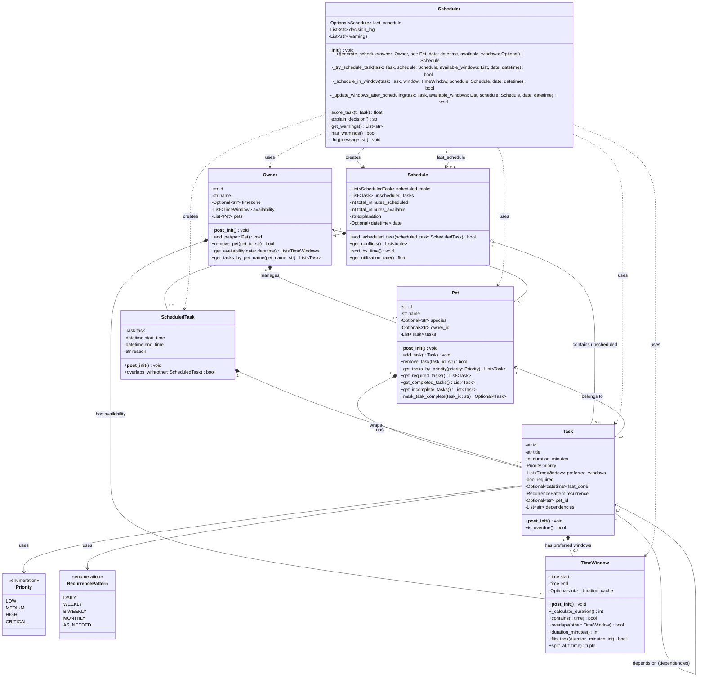

# PawPal+ UML Class Diagram

This diagram reflects the **final implementation** of the PawPal+ scheduling system, including all algorithm improvements, filtering methods, recurring task logic, and conflict detection.

## Mermaid Class Diagram

## Key Design Patterns & Relationships

### Composition (Strong "has-a") *--
- **Owner *-- Pet**: Owner manages and owns pets
- **Owner *-- TimeWindow**: Owner has availability windows
- **Pet *-- Task**: Pet has tasks that belong exclusively to it
- **Task *-- TimeWindow**: Task has preferred time windows
- **ScheduledTask *-- Task**: ScheduledTask wraps a task with timing info
- **Schedule *-- ScheduledTask**: Schedule contains scheduled tasks

### Aggregation (Weak "has-a") o--
- **Schedule o-- Task**: Schedule references unscheduled tasks (doesn't own them)

### Association (Uses) -->
- **Pet --> Owner**: Pet belongs to an owner (via owner_id)
- **Task --> Pet**: Task belongs to a pet (via pet_id)
- **Task --> Priority**: Task uses Priority enum
- **Task --> RecurrencePattern**: Task uses RecurrencePattern enum
- **Task --> Task**: Task can depend on other tasks

### Dependency (Uses temporarily) ..>
- **Scheduler ..> Schedule**: Creates and returns schedules
- **Scheduler ..> Owner/Pet/Task/TimeWindow**: Uses these to generate schedules
- **Scheduler --> Schedule**: Maintains reference to last_schedule

## Algorithm Improvements Reflected in UML

### TimeWindow Class
- **`_duration_cache`**: O(1) cached duration calculation (~70% faster)
- **`_calculate_duration()`**: Pre-calculates duration once in `__post_init__`
- **`split_at()`**: Enables window fragmentation for better utilization

### Pet Class
- **`get_completed_tasks()`**: Filter by completion status
- **`get_incomplete_tasks()`**: Filter incomplete tasks
- **`mark_task_complete()`**: Auto-creates recurring task instances

### Task Class
- **`dependencies`**: List of task IDs for dependency checking
- **`is_overdue()`**: Calculates if task is past due based on recurrence

### Schedule Class
- **`add_scheduled_task()`**: Uses `bisect.insort()` for O(log n) binary search insertion
- **`get_conflicts()`**: Detects overlapping scheduled tasks
- **`get_utilization_rate()`**: Measures schedule efficiency

### Scheduler Class
- **`warnings`**: Tracks conflicts without crashing
- **`_update_windows_after_scheduling()`**: Window fragmentation (15-200% improvement)
- **`score_task()`**: Multi-factor scoring with:
  - Priority level scoring
  - Required task bonus (+2.0)
  - Overdue scaling (+0.5/day, max +3.0)
  - Window fit optimization (+0.0 to +0.5)
  - Recency penalty
- **`has_warnings()` / `get_warnings()`**: Conflict detection API

## Method Categories

### Public API Methods (User-facing)
- Owner: `add_pet()`, `remove_pet()`, `get_availability()`, `get_tasks_by_pet_name()`
- Pet: `add_task()`, `remove_task()`, `get_tasks_by_priority()`, `get_required_tasks()`, `get_completed_tasks()`, `get_incomplete_tasks()`, `mark_task_complete()`
- Schedule: `add_scheduled_task()`, `get_conflicts()`, `sort_by_time()`, `get_utilization_rate()`
- Scheduler: `generate_schedule()`, `score_task()`, `explain_decision()`, `get_warnings()`, `has_warnings()`

### Internal Helper Methods (Private)
- TimeWindow: `_calculate_duration()`
- Scheduler: `_try_schedule_task()`, `_schedule_in_window()`, `_update_windows_after_scheduling()`, `_log()`

### Validation Methods
- All classes: `__post_init__()` for data validation

## Class Responsibilities

| Class | Primary Responsibility |
|-------|----------------------|
| **Priority** | Define importance levels for tasks |
| **RecurrencePattern** | Define how often tasks repeat |
| **TimeWindow** | Represent and manipulate time intervals |
| **Owner** | Manage pets and availability schedule |
| **Pet** | Manage tasks for a specific pet |
| **Task** | Represent a care activity with constraints |
| **ScheduledTask** | Represent a task assigned to specific time |
| **Schedule** | Hold complete daily schedule with metrics |
| **Scheduler** | Core algorithm: generate optimal schedules |

## Data Flow

1. **Input**: Owner + Pet + Tasks + TimeWindows
2. **Processing**: Scheduler.generate_schedule()
   - Separates required/optional tasks
   - Scores and sorts tasks (required first)
   - Tries to schedule each task using fragmentation
   - Detects conflicts and generates warnings
3. **Output**: Schedule object with:
   - Scheduled tasks (sorted by time)
   - Unscheduled tasks
   - Utilization metrics
   - Explanation text
   - Conflict warnings

## Copy this diagram to:
- Draw.io: Import as Mermaid
- Lucidchart: Import as Mermaid
- PlantUML: Convert syntax
- Documentation: Render with Mermaid JS

