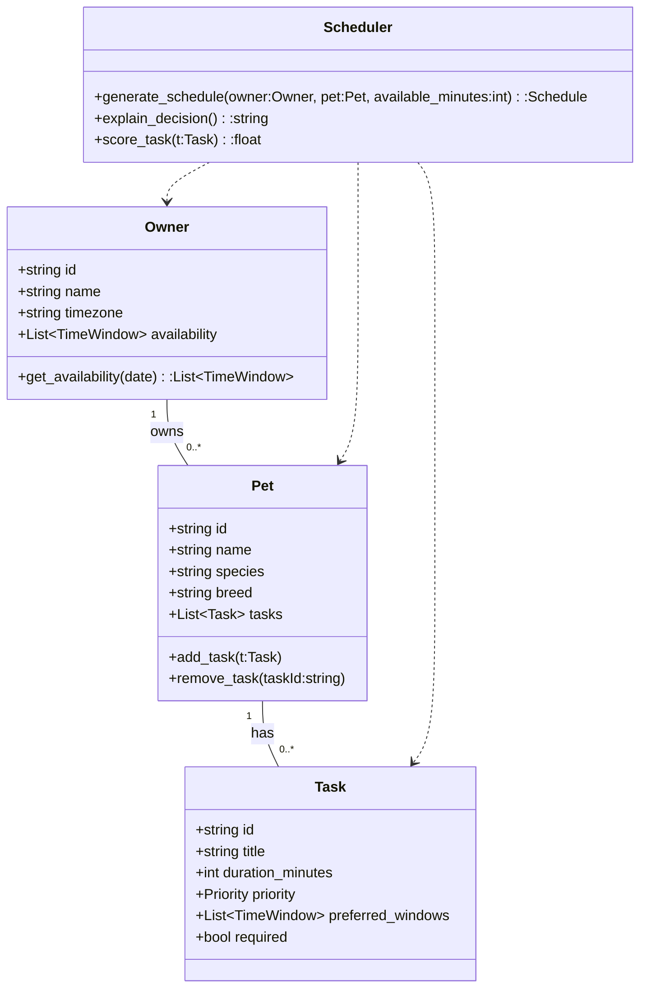

## UML - Mermaid Class Diagram

Brief roles:
- `Owner`: user identity and availability windows.
- `Pet`: groups tasks for a specific pet.
- `Task`: duration, priority, preferred windows, required flag.
- `Scheduler`: core algorithm that builds a schedule, scores tasks, and explains decisions.

Next steps: convert these classes into Python stubs or add unit tests for scheduling behavior.
